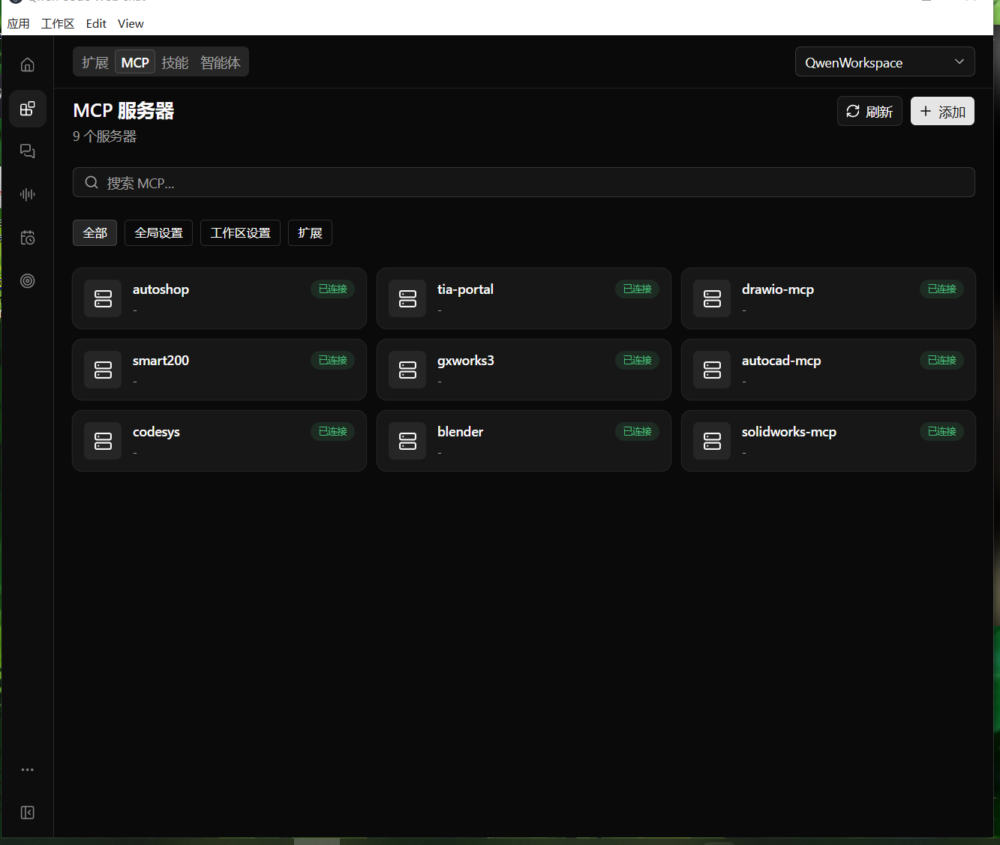
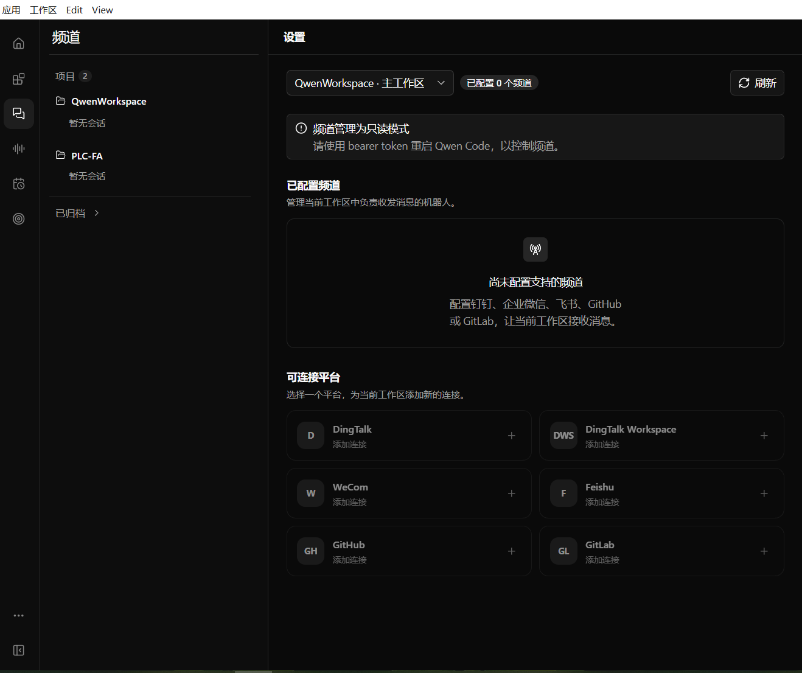
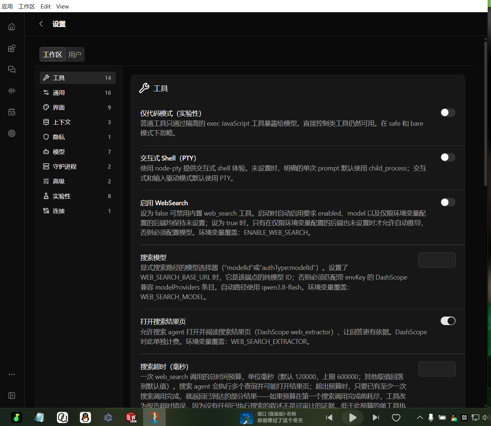

# AgentFA — 工科软件 AI 自动化助手

> 让 AI 直接驱动你电脑里的工科软件：PLC 编程、CAD 画图、三维建模、电气设计、图表绘制 —— 装完即用，无需配环境。

> [!IMPORTANT]
> **当前为测试版**。正在陆续接入更多理工科软件接口（CAD / CAE / PLC / 电气 / 仿真…），能力清单与规划见 [工科软件API自动化调用能力汇总.md](工科软件API自动化调用能力汇总.md)，持续更新中，欢迎提出你需要的软件与场景。

AgentFA 是一个 Windows 桌面应用，把 [Qwen Code](https://github.com/QwenLM/qwen-code)（AI 编程助手）与一组**工业/工科软件 MCP 工具桥**打包成开箱即用的安装包。对话式操作：你说需求，AI 调用 AutoCAD 画图、给 iFA 写 PLC 程序、操控 SolidWorks 建模。

## 截图

| | | |
|---|---|---|
|  |  |  |

## 特性

- **开箱即用**：自带 Node.js / Python 运行时与全部 MCP 依赖（安装包约 400 MB），目标机**无需安装任何开发环境**
- **对话驱动工科软件**：通过 MCP（Model Context Protocol）桥接 10+ 种工科软件，AI 直接调用其 API 完成操作
- **自动注册**：安装后首次启动自动把全部工具注册进 AI 运行时，二次启动零写入、不打扰已有配置
- **离线授权**：机器码绑定 + 免码试用 30 天 + 长期授权码，全程不需要联网验证
- **稳定后台**：内置 AI 服务守护进程（健康检查 / 自动重试 / 端口稳定 / 干净退出），只监听本机 127.0.0.1

## 系统要求

- Windows 10 / 11（x64）
- 部分工具桥需要对应宿主软件已安装并运行（见下表）
- 无需管理员权限（当前用户级安装）

## 安装与首次使用

1. 下载 `QwenApp-x.x.x-setup.exe`，双击安装（可选安装目录）
2. 首次启动进入激活页：**复制机器码**申请授权码，或点「试用 30 天」直接开始
3. 进入主界面后，在设置中配置你的**模型 API Key**（一次即可，自动保存）
4. **新建会话**——全部随包工具已自动注册，直接对话使用

> 试用从点击那一刻起算 30 个自然日，与开关机无关；到期后粘贴长期授权码可继续使用，数据不丢。

## 内置工具桥

| 工具桥 | 驱动的软件 | 说明 |
|---|---|---|
| ifa-mcp-server | iFA Evolution | PLC 编程：工程/资源树管理、程序读写等（230+ 工具，gRPC 连接本机 iFA） |
| autocad-mcp | AutoCAD | 绘图 / 实体 / 图层 / 块 / 标注 / 布局等 8 组能力，支持 LISP 执行 |
| codesys | CODESYS 3.5 | 持久模式 PLC 编程（路径与 profile 在 `mcp-local.json` 中按机器配置） |
| inoproshop | InoProShop（汇川） | 同为 CODESYS 系，默认关闭，按需启用 |
| smart200 | Step7-MicroWIN | S7-200 SMART PLC（UI 自动化 + snap7） |
| solidworks-mcp-server | SolidWorks | 零件/装配/工程图自动化（COM） |
| gxworks3 | GX Works3（三菱） | PLC 工程自动化（需 .NET 10 Desktop Runtime） |
| eplan | EPLAN P8 | 电气设计自动化（基于 .NET API 脚本执行） |
| drawio-mcp | draw.io | 图表生成 / 流程图绘制 |
| blender | Blender | 三维建模 / 渲染（经 `uvx` 运行，需网络） |

> 每台机器的差异项（如 CODESYS 安装路径）集中在 `%APPDATA%\qwenapp\mcp-local.json`，应用只读不覆盖；改完点菜单「重建 MCP 配置」即可生效。
> 工具**执行**需要对应宿主软件已安装并运行；未安装的软件不影响其他工具使用。

## 目录与文件

| 位置 | 内容 |
|---|---|
| `%APPDATA%\qwenapp\settings.json` | 应用配置（项目列表 / 端口 / 会话上限） |
| `%APPDATA%\qwenapp\mcp-local.json` | 每台机器的 MCP 可变项（应用只读） |
| `%APPDATA%\qwenapp\logs\` | 运行日志（daemon.log / mcp-sync.log），排错先看这里 |
| `~\.qwen\settings.json` | AI 运行时配置（模型 Key / MCP 清单），与命令行 qwen 共用 |
| `%LOCALAPPDATA%\Programs\Qwen App\` | 安装目录（含自带运行时） |

## 常见问题

| 现象 | 处理 |
|---|---|
| 工具列表里没有某个桥 | 新建一个会话（MCP 按会话懒加载，旧会话不回填） |
| 某工具执行报错 | 确认对应宿主软件已安装并运行；仍失败看 `logs\mcp-sync.log` 与 `daemon.log` |
| 提示缺少 mcp-local 字段 | 打开 `%APPDATA%\qwenapp\mcp-local.json` 按提示补填，再点「重建 MCP 配置」 |
| 对话中切换页面报 Failed to fetch | 已内置自愈；若复现，抓 `logs\daemon.log` 反馈 |
| 卸载后想彻底清除试用记录 | `reg delete HKCU\Software\QwenApp /f` 并删除 `%PROGRAMDATA%\QwenApp` |

## 从源码构建

```bash
git clone <本仓库> && cd AgentFA
npm install          # 国内网络自动走 npmmirror（仓库内置 .npmrc）
npm run build        # TypeScript 编译
npm run smoke        # 端到端回归（需已装配随包运行时）
npm run vendor       # 装配便携 node/python/qwen 运行时到 resources/runtime
npm run dist         # 产出 dist-electron/QwenApp-setup.exe
```

技术栈：TypeScript + Electron + [@qwen-code/qwen-code](https://www.npmjs.com/package/@qwen-code/qwen-code)（AI 运行时）+ 自研 MCP 桥接层。运行时/依赖全部钉死版本，任意时间重建产物一致；详见 [`doc/`](doc) 目录的复现手册。

## 安全说明

- 模型 API Key 只保存在本机 `~\.qwen\settings.json`，**不进安装包、不上传**
- 应用不写系统 PATH、不装全局包；除自身目录与授权锚点外零写入
- 授权采用 Ed25519 离线签名：公钥编译进应用，私钥永不入仓库；授权码被改任意字符即失效
